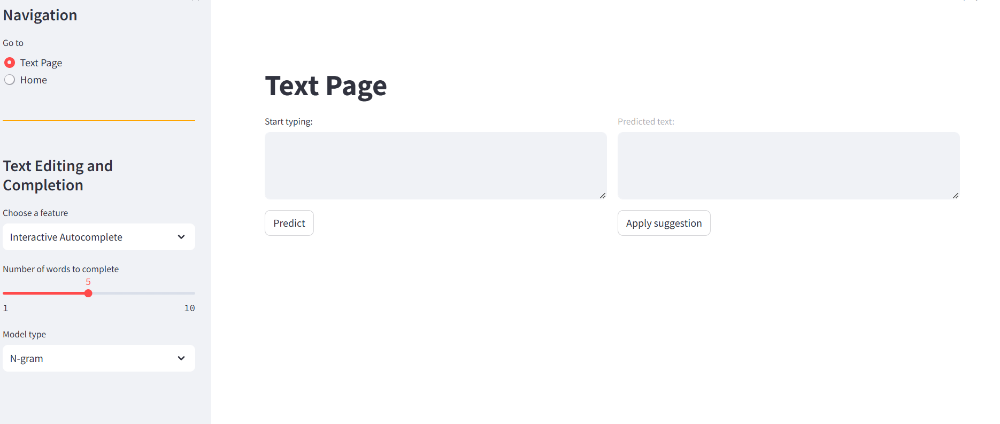

# Text-Flow

## Introduction

TextFlow is a Streamlit app providing text correction and autocomplete functionalities using n-grams language model or an LSTM model. Users can correct their text and predict the next words with configurable options.
TextFlow offers powerful text correction and autocompletion features to enhance your writing experience. Whether you prefer n-grams or LSTM models, TextFlow has you covered with customizable options to suit your needs.



## Features

- Text correction
- Autocomplete next words
- Choose between n-grams and LSTM models
- Customize the number of words to be predicted
- Various configurable settings for a personalized experience

## Installation

Follow these steps to get the TextFlow App up and running:

### Method 1: Using Docker

1. Clone the repository:

   ```sh
   git clone https://github.com/achrafib1/Text-Flow.git
   cd textflow
   ```

2. Build and run the Docker container:
   ```sh
   docker build -t textflow .
   docker run -p 8501:8501 textflow
   ```

### Method 2: Regular Setup

1. Clone the repository:

   ```sh
   git clone https://github.com/achrafib1/Text-Flow.git
   cd textflow
   ```

2. Set up a virtual environment (Optional but Recommended):

   ```sh
   python -m venv venv
   ```

3. Activate the Virtual Environment:
   - For Windows:
     ```sh
     .\venv\Scripts\activate
     ```
   - For macOS/Linux:
     ```sh
     source venv/bin/activate
     ```
4. Install the necessary files:

   ```sh
   python config.py
   ```

5. Install the dependencies:

   ```sh
   pip install -r requirements.txt
   ```

6. Run the Streamlit app:
   ```sh
   streamlit run src/app.py
   ```

## Usage

### Access the App

#### Method 1: Using Docker

After running the Docker container, open your browser and navigate to `http://localhost:8501`.

#### Method 2: Regular Setup

After running the Streamlit app with:

```sh
streamlit run src/app.py
```

Open your browser and navigate to `http://localhost:8501`.

## License

Distributed under the MIT License. See `LICENSE` for more information.
